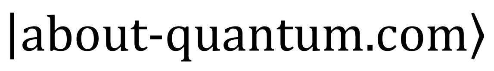

.. created by sphinx-quickstart on Sun Jan  3 18:40:01 2021.

:og:description: A basic introduction to Quantum Technology, and a guide on how to learn more about it.

-----

Learning about Quantum 2.0
==========================

A basic introduction to Quantum Technology,
and a guide on how to learn more about it.

.. note::

    This site is still under development.
    Stories may be incomplete or still a draft,
    the overall structure may change too.
    
    Started as both a personal cheatsheet and an annotated bibliography,
    these pages are continuously evolving.
    **Visit frequently to watch the progress!**

.. include:: qutex.rst

.. math::

    i \hbar \pdv{\ket{\psi(t)}}{t} = \hat{H} \ket{\psi(t)}

.. ---------------------------------------------------------------------------

.. toctree::
    :hidden:
    :maxdepth: 1
    :caption: My Contribution
    
    intro/intro
    stories/complements/complements
    stories/background/background
    reviews/reviews

.. toctree::
    :hidden:
    :maxdepth: 2
    :caption: Learn more
    
    about/syllabus
    online/online
    biblio/biblio
    news/news

.. toctree::
    :hidden:
    :maxdepth: 2
    :caption: About

    about/about

.. ---------------------------------------------------------------------------

.. comment:

    layout inspired by https://docs.readthedocs.io/en/stable/
    
    # stories in intro:
    
    # stories in complements and background: 29
    Implementation 2
    Illustration 5
    Basic 6
    Advanced 7
    Technical 2
    Conceptual 4
    Miscellaneous 3

.. ---------------------------------------------------------------------------

An Introduction
---------------

* **Quantum 2.0:**
  :ref:`intro/quantum2/revolution:A Revolution` |
  :ref:`intro/quantum2/superposition:Superposition` |
  :ref:`intro/quantum2/entanglement:Entanglement` |
  :ref:`intro/quantum2/ingredients:More Ingredients`

* **Quantum Computing:**
  :ref:`intro/computing/idea:Idea` |
  :ref:`intro/computing/models:Computing Models` |
  :ref:`intro/computing/gates:Gate Model` |
  :ref:`intro/computing/noise:Noise & Errors` |
  :ref:`intro/computing/algo:Algorithms` |
  :ref:`intro/computing/apps:Applications` |
  :ref:`intro/computing/realization:Realization`

* **Quantum Simulation:**
  :ref:`intro/simulation/simulate:Simulate Quantum Systems` |
  :ref:`intro/simulation/apps:Applications` |
  :ref:`intro/simulation/realization:Realization`

* **Quantum Communication:**
  :ref:`Teleportation & Cryptography <intro/communication/communication:Quantum Communication>`

* **Outlook:**
  :ref:`intro/outlook/state:State of the Art`

Complements
-----------

* **Applications:**
  :ref:`stories/complements/opti:Combinatorial Optimization` |
  :ref:`stories/complements/mlearn:Machine Learning` |
  :ref:`stories/complements/classical:Classical Physics` |
  :ref:`stories/complements/shor:Breaking RSA` |
  :ref:`stories/complements/condmatter:Condensed-Matter Physics` |
  :ref:`stories/complements/chemistry:Quantum Chemistry` |
  Materials Science |
  Finance

* **Realization:**
  :ref:`stories/complements/entanglement:Entanglement` |
  :ref:`stories/complements/gates:Circuit Gates` |
  :ref:`stories/complements/photonics:Photonics` |
  :ref:`stories/complements/neutralatoms:Neutral Atoms` |
  :ref:`stories/complements/iontrap:Trapped Ions` |
  :ref:`stories/complements/supercond:Superconducting Circuits` |
  :ref:`stories/complements/qudots:Quantum Dots` |
  :ref:`stories/complements/nvcenters:NV Centers`

* **Illustration:**
  :ref:`stories/complements/bloch_sphere:Bloch Sphere` |
  :ref:`stories/complements/evolution:Evolution of a Qubit` |
  :ref:`stories/complements/stabilizer:Stabilizer Codes` |
  :ref:`stories/complements/bell:Bell Inequalities` |
  Birth and Grow of Superpositions

* **Computing Models:**
  :ref:`stories/complements/adiabatic:Adiabatic Quantum Computer` |
  :ref:`stories/complements/topological:Topological Quantum Computer`

Background
----------

* **Basics:**
  :ref:`stories/background/fundamental:Fundamental Principles` |
  Correspondence Principle |
  Uncertainty Principle |
  Measurements |
  :ref:`stories/background/angular_momentum:Angular Momentum` |
  :ref:`stories/background/harmonic:Harmonic Oscillator` |
  Two-Level Systems |
  :ref:`stories/background/rabi:Rabi Oscillations`

* **Advanced:**
  :ref:`stories/background/2ndquant:Second Quantization` |
  :ref:`stories/background/environment:Environment` |
  Unitary Operators |
  Trace Preservation |
  :ref:`stories/background/pauli_operators:Pauli Operators` |
  Phase of a Qubit |
  Phase Damping |
  Hamiltonians

* **Technical:**
  Interaction Picture |
  Rotating Wave Approximation

* **Conceptual:**
  Young Double-Slit Experiment |
  :ref:`stories/background/EPR_experiments:EPR Experiments` |
  Non-locality & Contextuality |
  Conterfactuals

* **Miscellaneous:**
  Maths for QM |
  Nobel Prices |
  Glossary

* **Related Subjects:**
  Atomic Physics |
  Quantum Chemistry |
  Quantum Many-Body Physics |
  Group Theory |
  Combinatorial Optimization

Reviews
-------

* **Conferences:**
  :ref:`reviews/ieee_qce21:IEEE QCE21`
* **Research:**
  :ref:`reviews/google:Google Quantum AI`
* **Focus:**
  :ref:`reviews/kernels:Quantum Kernels`

Learn more
----------

* :ref:`about/syllabus:Syllabus`
* :ref:`online/online:Online Resources`
* :ref:`biblio/biblio:Bibliography`
* :ref:`news/news:News`

Read also about the :ref:`Story <about/story:The Story>` behind these notes. 

.. ---------------------------------------------------------------------------
