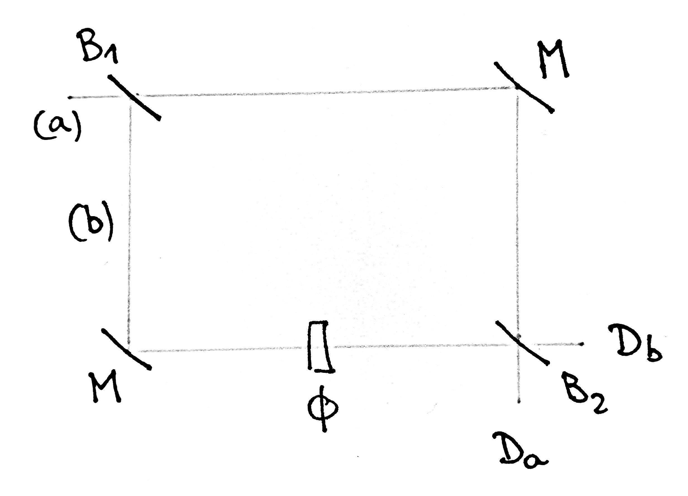

Superposition
=============

.. include:: ../../qutex.rst

The superposition of states is a fundamental principle of quantum mechanics:
it describes a characteristic behavior of quantum systems to appear to be in different states
at the same time.

Superposition can be observed and analysed in the lab with interferometers.

One optical example is the **Mach-Zehnder interferometer**, :numref:`Mach-Zehnder`.
It is made of two beamsplitters, two mirrors and a dephasing element.
Incoming light in (a) may follow the upper (a) or lower (b) path.
Classically, interference patterns can be observed on the detectors :math:`D_a` and :math:`D_b`, depending on the phase :math:`\phi`, that suggests that the light is splitted into two interfering beams.

    
    Mach-Zehnder interferometer, inspired by :cite:`Haroche2013`, Fig. 3.16

An other example is the **Ramsey interferometer**, :numref:`Ramsey`.
The interference is observed on an isolated atom that behaves as a two-level quantum system,
i.e. it can be either in the energy ground state :math:`\ket{g}` or an excited state :math:`\ket{e}`.
The two levels are the equivalent to the two paths (a) and (b) described in the previous experiment.
An electromagnetic field is applied on this atom in a superconducting cavity,
and induces a transition from one state to the other, a so-called :math:`\pi / 2`
:ref:`Rabi pulse <stories/background/rabi:Rabi Oscillations>`.
By precisely controlling the frequency and interaction time,
a superposition of the states :math:`\ket{g}` and :math:`\ket{e}` can be achieved,
in analogy to the beam splitter above.
Then by applying an electric field, a phase shift can be induced for one of the two states.
Finally, by combining two pulses and the phase shift, an by detecting the state of the atom,
interference patterns can be observed as for the optical experiment.

.. figure:: images/Ramsey.jpg
    :width: 50 %
    :name: Ramsey
    
    Ramsey interferometer, inspired by :cite:`Haroche2013`, Fig. 3.16

The striking feature is that the interference is observed on only one single atom,
and that it can obviously interfer with itself!
Superposition is the requirement for this interference.

An other famous experiment that reveals superposition is the
:ref:`stories/background/young_slit:Young Double-Slit Experiment`.

More insight about :ref:`stories/background/fundamental:Superposition`
in the :ref:`stories/background/fundamental:Fundamental Principles` section.

-----

**References:**
Mach-Zehnder Interferometer, :cite:`Haroche2013` section 3.2.3 ;
Ramsey Interferometer, :cite:`Haroche2013` section 3.3.3.
